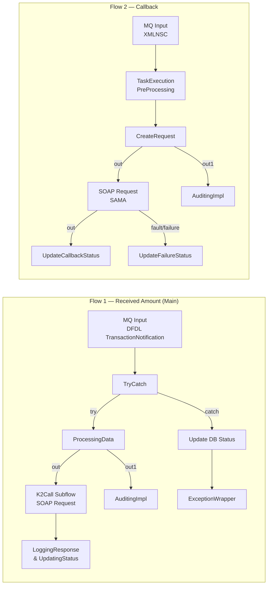

# Code Review — TanfeethFulfillmentReceivedAmountApp

**Reviewer:** AI Code Reviewer  
**Date:** 2026-03-30  
**Scope:** All ESQL modules, message flows, subflows, and stored procedures within the application  
**Baseline:** Functional & Technical Specification v1.0

---

## 1. Architecture Overview

The application consists of **two message flows** packaged in a single IIB Application with three shared library dependencies:



### Files Reviewed

| File | Purpose |
|------|---------|
| [ProcessingData.esql](file:///c:/Users/MahmoudKamalRashed/Downloads/Fullfilment_Repo/Fullfilment/IIB/TanfeethFulfillmentReceivedAmountApp/gen/TanfeethFulfillmentReceivedAmount_ProcessingData.esql) | Core business logic — threshold evaluation, deposit persistence, SOAP construction |
| [Utils.esql](file:///c:/Users/MahmoudKamalRashed/Downloads/Fullfilment_Repo/Fullfilment/IIB/TanfeethFulfillmentReceivedAmountApp/gen/Utils.esql) | Database procedures (hold lookup, sum, customer, currency, status update) |
| [K2Call_Logging_And_Setting_URL.esql](file:///c:/Users/MahmoudKamalRashed/Downloads/Fullfilment_Repo/Fullfilment/IIB/TanfeethFulfillmentReceivedAmountApp/gen/K2Call_Logging_And_Setting_URL.esql) | K2 endpoint URL override + logging |
| [LoggingResponseAndUpdatingStatus.esql](file:///c:/Users/MahmoudKamalRashed/Downloads/Fullfilment_Repo/Fullfilment/IIB/TanfeethFulfillmentReceivedAmountApp/gen/TanfeethFulfillmentReceivedAmount_LoggingResponseAndUpdatingStatus.esql) | K2 response logging + status update to `'2'` + K2 execution info insert |
| [Update_database_Status.esql](file:///c:/Users/MahmoudKamalRashed/Downloads/Fullfilment_Repo/Fullfilment/IIB/TanfeethFulfillmentReceivedAmountApp/gen/TanfeethFulfillmentReceivedAmount_Update_database_Status.esql) | Exception-path status update to `'1'` |
| [Callback_CreateRequest.esql](file:///c:/Users/MahmoudKamalRashed/Downloads/Fullfilment_Repo/Fullfilment/IIB/TanfeethFulfillmentReceivedAmountApp/gen/TanfeethFulfillmentRecievedAmountCallback_CreateRequest.esql) | SAMA callback request builder |
| [Callback_Updating_Callback_Status.esql](file:///c:/Users/MahmoudKamalRashed/Downloads/Fullfilment_Repo/Fullfilment/IIB/TanfeethFulfillmentReceivedAmountApp/gen/TanfeethFulfillmentRecievedAmountCallback_Updating_Callback_Status.esql) | SAMA callback success handler |
| [Callback_Updating_Failure_status.esql](file:///c:/Users/MahmoudKamalRashed/Downloads/Fullfilment_Repo/Fullfilment/IIB/TanfeethFulfillmentReceivedAmountApp/gen/TanfeethFulfillmentRecievedAmountCallback_Updating_Failure_status.esql) | SAMA callback failure handler |
| [K2Call.subflow](file:///c:/Users/MahmoudKamalRashed/Downloads/Fullfilment_Repo/Fullfilment/IIB/TanfeethFulfillmentReceivedAmountApp/K2Call.subflow) | SOAP Request subflow to K2 adapter |
| [Main Flow](file:///c:/Users/MahmoudKamalRashed/Downloads/Fullfilment_Repo/Fullfilment/IIB/TanfeethFulfillmentReceivedAmountApp/gen/TanfeethFulfillmentReceivedAmount.msgflow) | Message flow definition |

---

## 2. Requirements Compliance Matrix

### ✅ Requirements Met

| Req ID | Requirement | Status | Evidence |
|--------|-------------|--------|----------|
| FR-01 | Triggered by MQ message in DFDL format | ✅ Met | MQ Input node: `messageDomainProperty="DFDL"`, queue `MIKE.IIB.TanfeethFulfillRecievedAmount` |
| FR-02 | Conforms to `TransactionNotification` DFDL model | ✅ Met | `messageTypeProperty="{}:TransactionNotification"`, messageSet from `TanfeethFulfillmentReceivedAmountLib` |
| FR-03 | Query DB for active holds | ✅ Met | `getAccountHoldByAccountNumber()` in Utils.esql — joins `ACCOUNT_HOLD` with `CRITERIA_DETAILS` |
| FR-04 | No holds → log + terminate | ✅ Met | Lines 68-72: logs "No hold found" and `RETURN FALSE` |
| FR-05 | Process first hold record | ✅ Met | Uses `accountHolds.records[1]` throughout |
| FR-06 | Retrieve currency exponent | ✅ Met | `getCurrencyByCurrencyCode()` in Utils.esql |
| FR-07 | Calculate deposit amount with exponent | ✅ Met | Line 75: `TrxAmt / 10^exponent` calculation |
| FR-08 | Generate unique Event ID | ✅ Met | Line 90: `FULFILLMENT_DEPOSIT_SEQ` sequence |
| FR-09 | Insert deposit record | ✅ Met | Lines 92-93: INSERT with all specified columns |
| FR-10 | Initial status `'0'` (Pending) | ✅ Met | Hardcoded `'0'` in INSERT |
| FR-11 | Immediate commit | ✅ Met | Line 94: `PASSTHRU(' commit work;')` |
| FR-12 | Condition 1 — Single deposit + balance ≥ hold | ✅ Met | Line 102: `totalValue + AMOUNT_IN_ACCOUNT_CURRENCY >= holdAccValue` |
| FR-16 | Customer info retrieval | ✅ Met | Line 126: `getCustomerByAccountNumber()` |
| FR-17 | Customer data: IBAN, IDVALUE, DOCUMENT_TYPE, CUSTOMER_NAME | ✅ Met | SQL in Utils.esql selects all four fields |
| FR-18 | Update deposit record pre-notification | ✅ Met | Lines 140-141: UPDATE with SRN, IBAN, Hold Amount, etc. |
| FR-19 | Construct SOAP request | ✅ Met | Lines 144-186: Full SOAP envelope construction |
| FR-20 | SOAP schema compliance | ✅ Met | Correct namespace prefixes: `soapenv`, `tem`, `saib`, `ns` |
| FR-21 | Current deposit as first Credit entry | ✅ Met | Lines 149-155: First Credit created before loop |
| FR-23 | Output to K2 adapter | ✅ Met | `RETURN TRUE` propagates to output terminal → K2Call subflow |
| FR-25 | No output on non-notification path | ✅ Met | `RETURN FALSE` at line 194 |

---

### ❌ Requirements with Issues

| Req ID | Requirement | Status | Details |
|--------|-------------|--------|---------|
| FR-13 | Condition 2 — cumulative deposits ≥ hold | ⚠️ **Bug** | See [BUG-01](#bug-01) — SQL queries `STATUS = '1'` (processed) instead of `STATUS = '0'` (pending) |
| FR-14 | Condition 3 — regulatory ≥ 5,000 | ⚠️ **Bug** | See [BUG-02](#bug-02) — Guard condition allows Condition 3 to apply even when Condition 2 already set `K2 = true` |
| FR-15 | Non-notification → status `'1'` | ✅ Met | Line 191: `UpdateStatus(EventId, '1')` |
| FR-22 | Include prior deposits in CreditList | ⚠️ **Bug** | See [BUG-03](#bug-03) — EventId references wrong field, same status filter issue |
| FR-24 | Non-notification → status `'1'` + RETURN FALSE | ✅ Met | Lines 191-194 |

---

## 3. Critical Bugs

### BUG-01: Status Filter Inversion in Deposit Sum & Retrieval Queries {#bug-01}

> [!CAUTION]
> **Severity: CRITICAL** — This directly affects the correctness of threshold evaluation (FR-13, FR-14).

**Location:** [Utils.esql](file:///c:/Users/MahmoudKamalRashed/Downloads/Fullfilment_Repo/Fullfilment/IIB/TanfeethFulfillmentReceivedAmountApp/gen/Utils.esql), Lines 32 and 37

**Problem:** Both `getTotalDepositAMT` and `getSUMDepositAMT` filter on `STATUS = '1'` (processed/no-notification), but the spec says they should query deposits with `STATUS = '0'` (pending).

```diff
-- getTotalDepositAMT (Line 32)
- WHERE ACCOUNT_NUMBER = ? AND STATUS = ''1''
+ WHERE ACCOUNT_NUMBER = ? AND STATUS = ''0''

-- getSUMDepositAMT (Line 37)
- WHERE ACCOUNT_NUMBER = ? AND STATUS = 1
+ WHERE ACCOUNT_NUMBER = ? AND STATUS = ''0''
```

**Impact:** 
- Condition 2 and Condition 3 use the **wrong population** of deposit records
- Newly recorded pending deposits are excluded from the cumulative sum
- Previously notified/processed deposits are erroneously included
- Could result in **false notifications or missed notifications** — both regulatory failures

**Additional note on `getSUMDepositAMT`:** The `STATUS = 1` comparison is unquoted (numeric), while the column stores `VARCHAR(1)`. This may cause an implicit type cast or error depending on DB2 configuration.

---

### BUG-02: Condition 3 Guard Logic Is Incorrect {#bug-02}

> [!WARNING]
> **Severity: HIGH** — Could lead to duplicate notification triggers.

**Location:** [ProcessingData.esql](file:///c:/Users/MahmoudKamalRashed/Downloads/Fullfilment_Repo/Fullfilment/IIB/TanfeethFulfillmentReceivedAmountApp/gen/TanfeethFulfillmentReceivedAmount_ProcessingData.esql), Lines 118-122

**Problem:** The Condition 3 check (`totalValue >= 5000`) is reached even when Condition 2 has already set `K2 = true`. The `totalValue` variable already includes the cumulative sum from Condition 2's calculation path, so the guard `EnvVarRef.K2 = False` is correct in intent — but if Condition 1 fails and Condition 2 fails, `totalValue` at this point only includes the cumulative deposits if the `ELSE` branch (lines 106-116) was taken. However, if Condition 1 **succeeds**, lines 106-116 are skipped, meaning `totalValue` doesn't include prior deposits and the `getSUMDepositAMT` was never called. This means:

- If Condition 1 passes → `K2 = true`, Condition 3 check is skipped (correct) but `depositRecords` is not set (correct per spec: only current deposit in CreditList)
- If Condition 1 fails, Condition 2 fails → `totalValue` correctly includes sum, Condition 3 is evaluated (correct)
- **Edge case:** If Condition 1 fails and Condition 2 passes, `K2 = true` and `depositRecords = true` — then **Condition 3 block is still evaluated** but skipped by `K2 = False` check ✅

**Verdict:** After careful analysis, the guard logic is **functionally correct** for the three-condition flow. However, the variable is never reset between checks, and the code structure is fragile. The real problem is BUG-01 above, which corrupts `totalValue` with wrong data.

---

### BUG-03: EventId Field Reference Error in Credit Loop {#bug-03}

> [!CAUTION]
> **Severity: CRITICAL** — EventId will always be NULL for historical credit entries.

**Location:** [ProcessingData.esql](file:///c:/Users/MahmoudKamalRashed/Downloads/Fullfilment_Repo/Fullfilment/IIB/TanfeethFulfillmentReceivedAmountApp/gen/TanfeethFulfillmentReceivedAmount_ProcessingData.esql), Line 165

**Problem:** The code references `eventIdROW.records[1].EVENT_ID`, but the sequence query (line 90) returns the column as `TASK_LIST_ID` (via alias). Additionally, this is the **current** event's sequence value, not the historical deposit's EventId. The `getTotalDepositAMT` query doesn't even select `EVENTID` from the database.

```esql
-- Line 165 (current code — always NULL):
SET creditRefLoop.ns:EventId = eventIdROW.records[1].EVENT_ID;

-- Should reference the loop record's EVENTID:
-- But getTotalDepositAMT doesn't SELECT EVENTID either!
```

**Fix required in two places:**

```diff
-- 1. Utils.esql, getTotalDepositAMT — add EVENTID to SELECT:
- SELECT DEPOSIT_AMOUNT, DEPOSIT_CURRENCY, HOLD_EXCHANGE_RATE, TRANSACTIONID
+ SELECT EVENTID, DEPOSIT_AMOUNT, DEPOSIT_CURRENCY, HOLD_EXCHANGE_RATE, TRANSACTIONID

-- 2. ProcessingData.esql, Line 165 — reference the loop record:
- SET creditRefLoop.ns:EventId = eventIdROW.records[1].EVENT_ID;
+ SET creditRefLoop.ns:EventId = record.EVENTID;
```

**Impact:** SAMA receives credit entries without EventIds for historical deposits, preventing traceability.

---

### BUG-04: Unreachable THROW After RESIGNAL {#bug-04}

> [!WARNING]
> **Severity: MEDIUM** — Dead code / incorrect error handling intent.

**Location:** Multiple files — Lines 87-88, 137-138 in ProcessingData.esql; Line 107-108 in Callback_CreateRequest.esql; Line 28 in Callback_Updating_Callback_Status.esql

**Problem:** After `RESIGNAL`, control flow leaves the handler. The subsequent `THROW USER EXCEPTION` is **never executed**.

```esql
-- Example from ProcessingData.esql lines 87-88:
RESIGNAL;                    -- ← control leaves here
THROW USER EXCEPTION ...;    -- ← DEAD CODE, never reached
```

**Impact:** The developer likely intended either RESIGNAL (re-throw the original exception) **or** THROW (throw a custom exception), but not both. The current behavior always re-signals the original SQL exception without the custom BIP 2951 message.

---

## 4. Moderate Issues

### MOD-01: FLOAT Used for Monetary Calculations

> [!WARNING]
> **Severity: MEDIUM** — Precision risk for regulatory financial data.

**Location:** ProcessingData.esql, Lines 75, 98, 100

```esql
Declare depositAmt FLOAT ...     -- Line 75
DECLARE totalValue float ...      -- Line 98
Declare holdAccValue FLOAT ...    -- Line 100
```

**Problem:** IEEE 754 floating-point cannot precisely represent many decimal values (e.g., `0.1`). For a regulatory financial system handling SAR amounts, this introduces rounding errors.

**Spec Reference:** Constraint C4 explicitly flags this: *"FLOAT is used for monetary calculations (precision risk)"*

**Recommendation:** Use `DECIMAL` type for all monetary fields.

---

### MOD-02: Hardcoded 5,000 Threshold

**Location:** ProcessingData.esql, Line 118

```esql
IF( EnvVarRef.K2 = False AND totalValue >= 5000) THEN
```

**Problem:** The regulatory threshold is hardcoded. Any regulatory change requires a code deployment.

**Spec Reference:** Constraint C2: *"The 5,000 threshold is hardcoded"*

**Recommendation:** Externalize as a UDP (User Defined Property) or database configuration value.

---

### MOD-03: Hardcoded Exchange Rate for Current Deposit

**Location:** ProcessingData.esql, Line 153

```esql
SET creditRef.ns:ExchnageRate = 1.0;
```

**Problem:** Assumes account currency always equals deposit currency. When currencies differ, SAMA receives an incorrect rate.

**Spec Reference:** Constraint C3; Improvement I5.

---

### MOD-04: PII Logged in Full Request Body

**Location:** ProcessingData.esql, Line 50

```esql
SET dataRef.TEXT = 'ICS Request Body: '||msgCharSegment ||'-$EOD';
```

**Problem:** The full DFDL message body (containing Customer Number, Account Number, etc.) is logged at INFO level. This violates SAMA data protection guidelines.

**Spec Reference:** NFR-07: *"Log entries SHALL NOT contain full PII"*

---

### MOD-05: No Idempotency / Deduplication

**Problem:** If the same MQ message is re-delivered (e.g., after an IIB restart), a duplicate deposit record is created with a new EventId. There is no check on `MsgId` or `TransactionId` uniqueness.

**Spec Reference:** NFR-05 (explicitly noted as not implemented).

---

### MOD-06: Reused Error Code Across All DB Operations

**Location:** All error handlers use `'TFA.ESB.C001'`

**Problem:** When an error occurs, there is no way to distinguish between: initial INSERT failure, UPDATE failure, sequence retrieval failure, or callback DB failures.

**Spec Reference:** Improvement I8.

---

### MOD-07: Inconsistent Log Message bracket styles

**Location:** ProcessingData.esql, Lines 43 and 46

```esql
SET dataRef.TEXT='ICS CorrID : {'||Cast(InputRoot.MQMD.CorrelId as CHARACTER)||']';
-- Uses { opening but ] closing
```

**Impact:** Minor — but inconsistent formatting makes log parsing harder.

---

## 5. Code Quality Observations

### 5.1 Naming & Conventions

| Issue | Location | Details |
|-------|----------|---------|
| Typo: "Recieved" vs "Received" | Throughout | Inconsistent — app name uses "Received" but queue, BAM text, callbacks use "Recieved" |
| SOAP field typos preserved | Lines 152-153 | `DepositeCurrency`, `ExchnageRate` — matches spec intentionally (SAMA schema) |
| Variable naming inconsistency | ProcessingData.esql | Mixed camelCase (`depositAmt`), PascalCase (`AcchldRef`), and SCREAMING_CASE in SQL |
| Unused variable `J` | Line 156 | Counter `J` is incremented but never used  |
| `CutomerInfoRef` typo | Line 125 | Should be `CustomerInfoRef` |

### 5.2 Unused Procedures

| Procedure | File | Notes |
|-----------|------|-------|
| `CopyMessageHeaders()` | All ESQL modules | Defined in every module but only called in `Update_database_Status.esql` (commented out) |
| `CopyEntireMessage()` | Most modules | Only actually used in `Update_database_Status.esql` and `Callback_Updating_Callback_Status.esql` |
| `GetDepositByEventId()` | Utils.esql | Never called anywhere — dead code |
| `getAccountHoldByAccountNumberCriteriaID()` | Utils.esql | Only used by callback flow, not main flow |

### 5.3 SQL Practices

| Issue | Details |
|-------|---------|
| `SELECT *` used in `GetDepositByEventId` | Should explicitly list columns |
| No parameterized query for sequence | Line 90: Full `PASSTHRU` with inline SQL — acceptable for sequences but inconsistent |
| Implicit commit semantics | Line 94: `PASSTHRU(' commit work;')` with leading space — relying on PASSTHRU for transaction control instead of node-level commit |

### 5.4 Missing Error Handling

| Gap | Location | Risk |
|-----|----------|------|
| Currency lookup failure | Line 74 | If `getCurrencyByCurrencyCode` returns no records, `currencyExponent.records[1].EXPONENT` throws a runtime error — no check for empty result |
| Customer lookup failure | Line 126 | Partially handled with `EXISTS(CustomerInfo.records[])` check at lines 173 and 181 ✅ |
| Hold query failure | Line 67 | No SQL error handler wrapping this call |
| `getTotalDepositAMT` failure | Line 159 | Inside the K2=true branch but not in a SQL error handler block |

---

## 6. Message Flow Analysis

### Main Flow — `TanfeethFulfillmentReceivedAmount.msgflow`

```
MQ Input → Try/Catch → ProcessingData ──(out)──→ K2Call → LoggingResponse
                                       └─(out1)─→ AuditingImpl
              └─(catch)─→ UpdateDBStatus → ExceptionWrapper
MQ Input ──(failure)──→ UpdateDBStatus → ExceptionWrapper
MQ Input ──(catch)────→ UpdateDBStatus → ExceptionWrapper
```

| Aspect | Finding |
|--------|---------|
| **MQ Input node** | Correctly configured: DFDL domain, `TransactionNotification` type |
| **Data source** | `SAIBAPP` — consistent across compute nodes |
| **Transaction mode** | ProcessingData node set to `commit` — aligns with FR-11 |
| **Exception handling** | Try/Catch → both `catch` and MQ Input `failure`/`catch` route to `UpdateDBStatus` → good |
| **K2Call subflow** | SOAP fault routes to Output (same as success) — no separate fault handling in main flow |
| **Missing** | No dedicated error notification to an error queue or monitoring system |

### K2Call Subflow

| Aspect | Finding |
|--------|---------|
| **WSDL** | References `RemoteFiles/K2IntService.wsdl` with operation `CreateTanFulRecAmoRequest` ✅ |
| **Endpoint** | Default `http://saibnt1937:7575/K2IntService.svc`, overridden by UDP `endPointURL` |
| **TLS** | `sslProtocol="TLS"` — ensure this aligns with K2 adapter requirements |
| **Fault handling** | Both `out` and `fault` terminals connect to the Output sink — faults are silently forwarded |

---

## 7. Response Handler Analysis

### LoggingResponseAndUpdatingStatus

| Aspect | Finding |
|--------|---------|
| Status update | Updates deposit to status `'2'` — **not documented in spec** (spec only mentions `'0'` and `'1'`) |
| K2 execution info | Inserts into `TANFEETHEXEC.K2_EXECUTION_INFO` — additional tracking table not in spec |
| Conditional insert | Only inserts when `K2RefNum IS NOT NULL` — good defensive check |
| Missing error handler | No SQL error handler for the INSERT into `K2_EXECUTION_INFO` |

> [!NOTE]
> Status `'2'` appears to mean "sent to K2 / awaiting SAMA" — this state is undocumented in the spec's status definitions.

---

## 8. Callback Flow Analysis

The callback flow (`TanfeethFulfillmentRecievedAmountCallback`) is a **separate use case** from the main received-amount flow. It handles the downstream SAMA callback after K2 processing.

| Aspect | Finding |
|--------|---------|
| Purpose | Sends reserved amount callback to SAMA after K2 approval |
| Input | MQ message on `IIB.TNFTH.EXECUTION.K2.PRCS.FULFIL.IN` (XMLNSC) |
| WSDL | `FIFFResrvdAmtCallBack.wsdl` — different operation from main flow |
| Amount cap | Line 64: Caps `TotalApprovedAcc` at `HOLD_AMOUNT` — business guard ✅ |
| FLOAT usage | Line 63: `CAST(inputRef.TotalApprovedAccCur AS FLOAT)` — same precision concern |
| Separate tracking table | `FULFILLMENT_RECIEVED_AMOUNT_CB` — good separation |
| Success/Failure handlers | Both have SQL error handlers ✅ |
| Scoping issue | Line 33 in `Updating_Callback_Status`: END block closes SQL handler before logging code — logging for response body happens outside the protected block |

---

## 9. Summary of Findings by Severity

| Severity | Count | IDs |
|----------|-------|-----|
| 🔴 **Critical** | 2 | BUG-01 (status filter inversion), BUG-03 (EventId field reference) |
| 🟠 **High** | 2 | BUG-04 (unreachable THROW), MOD-01 (FLOAT for money) |
| 🟡 **Medium** | 5 | MOD-02 (hardcoded threshold), MOD-03 (hardcoded FX rate), MOD-04 (PII logging), MOD-05 (no idempotency), MOD-06 (reused error code) |
| 🔵 **Low** | 4 | MOD-07 (bracket inconsistency), naming typos, unused code, SQL style |

---

## 10. Actionable Recommendations

### Immediate Fixes (Pre-Production)

| # | Action | Files | Effort |
|---|--------|-------|--------|
| 1 | **Fix status filter in `getSUMDepositAMT` and `getTotalDepositAMT`** — change `STATUS = '1'` → `STATUS = '0'` | [Utils.esql](file:///c:/Users/MahmoudKamalRashed/Downloads/Fullfilment_Repo/Fullfilment/IIB/TanfeethFulfillmentReceivedAmountApp/gen/Utils.esql) | Low |
| 2 | **Fix EventId reference** — add `EVENTID` to `getTotalDepositAMT` SELECT list, change loop reference to `record.EVENTID` | Utils.esql + ProcessingData.esql | Low |
| 3 | **Remove dead THROW after RESIGNAL** — pick one error strategy (RESIGNAL or THROW, not both) | All ESQL files | Low |
| 4 | **Add null check for currency exponent** — handle case where currency code is not found | ProcessingData.esql | Low |

### Short-Term Improvements

| # | Action | Effort |
|---|--------|--------|
| 5 | Replace `FLOAT` with `DECIMAL` for all monetary variables | Medium |
| 6 | Externalize 5,000 threshold as a UDP | Low |
| 7 | Add idempotency check on `MsgId`/`TransactionId` before INSERT | Medium |
| 8 | Mask PII in log entries (account numbers, customer names) | Medium |
| 9 | Use distinct error codes per operation (INSERT vs UPDATE vs SELECT failures) | Low |

### Long-Term Improvements

| # | Action | Effort |
|---|--------|--------|
| 10 | Support multi-hold processing per account | High |
| 11 | Handle cross-currency exchange rates properly | Medium |
| 12 | Add monitoring metrics (messages processed, notifications sent, errors) | Medium |
| 13 | Document status values (`'0'`, `'1'`, `'2'`) and their lifecycle | Low |
| 14 | Add comprehensive test coverage per §11 of spec | High |

---

## 11. Appendix: Requirement Traceability Summary

```
FR-01 ✅  FR-02 ✅  FR-03 ✅  FR-04 ✅  FR-05 ✅
FR-06 ✅  FR-07 ✅  FR-08 ✅  FR-09 ✅  FR-10 ✅
FR-11 ✅  FR-12 ✅  FR-13 ⚠️  FR-14 ⚠️  FR-15 ✅
FR-16 ✅  FR-17 ✅  FR-18 ✅  FR-19 ✅  FR-20 ✅
FR-21 ✅  FR-22 ⚠️  FR-23 ✅  FR-24 ✅  FR-25 ✅

NFR-01 ⬜  NFR-02 ⬜  NFR-03 ✅  NFR-04 ⚠️  NFR-05 ❌
NFR-06 ❌  NFR-07 ❌  NFR-08 ✅  NFR-09 ✅

Legend: ✅ Met  ⚠️ Partial/Bug  ❌ Not Met  ⬜ Not Verifiable in Code
```
