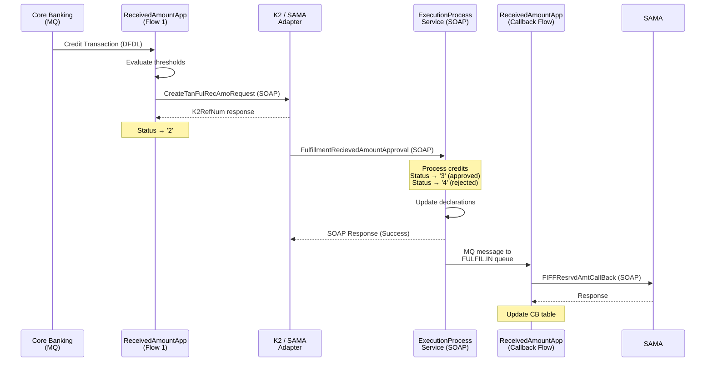
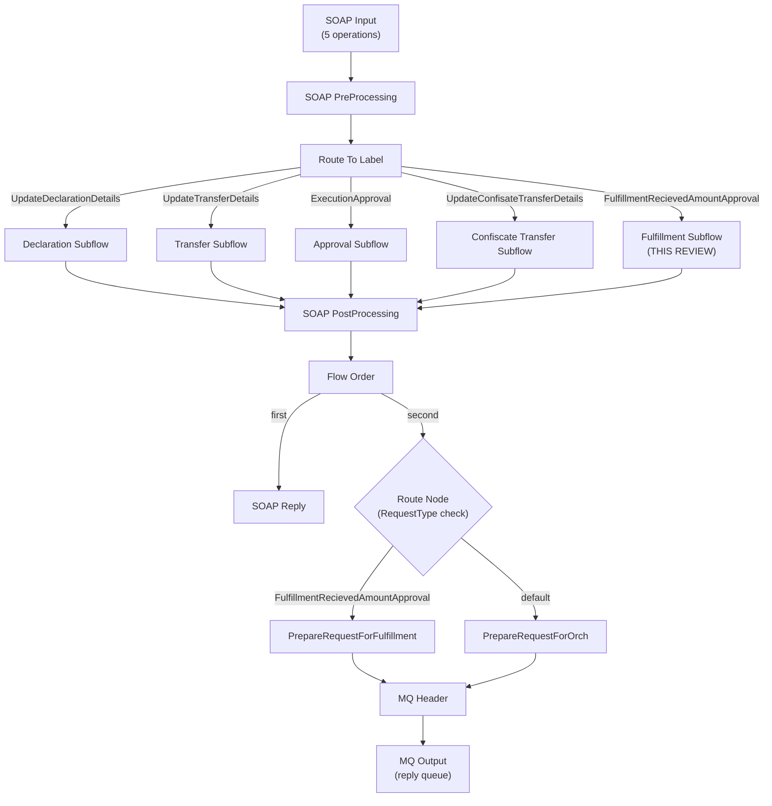
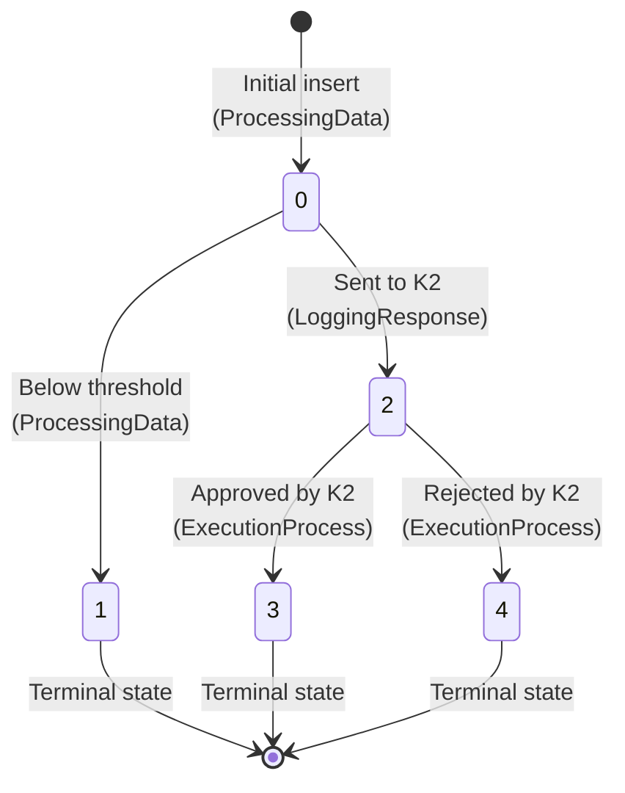

# Code Review — TanfeethExecutionProcessService (Fulfillment Package)

**Reviewer:** AI Code Reviewer  
**Date:** 2026-03-30  
**Scope:** `FulfillmentRecievedAmount` package + routing/preparation logic in `TanfeethExecutionProcessService`  
**Context:** K2 confirmation handler — receives approval events from K2, processes credit approvals/rejections, and triggers the downstream SAMA callback  
**Related Review:** [code_review.md](./code_review.md) (TanfeethFulfillmentReceivedAmountApp)

---

## 1. Architecture — End-to-End Flow

This review completes the full picture of the Tanfeeth Fulfillment Received Amount lifecycle:



### Files Reviewed

| File | Purpose |
|------|---------|
| [FulfillmentRecievedAmount_processRequest.esql](file:///c:/Users/MahmoudKamalRashed/Downloads/Fullfilment_Repo/Fullfilment/IIB/TanfeethExecutionProcessService/sa/com/saib/tanfeeth/fulfillment/FulfillmentRecievedAmount_processRequest.esql) | Core K2 confirmation logic — credit approval loop, declaration updates, SOAP response |
| [FulfillmentRecievedAmount.subflow](file:///c:/Users/MahmoudKamalRashed/Downloads/Fullfilment_Repo/Fullfilment/IIB/TanfeethExecutionProcessService/sa/com/saib/tanfeeth/fulfillment/FulfillmentRecievedAmount.subflow) | Subflow wrapper for the compute node |
| [PrepareRequestForFulfillment.esql](file:///c:/Users/MahmoudKamalRashed/Downloads/Fullfilment_Repo/Fullfilment/IIB/TanfeethExecutionProcessService/sa/com/saib/tanfeeth/TanfeethExecutionProcessService_PrepareRequestForFulfillment.esql) | Route message to callback queue |
| [PrepareRequestForOrch.esql](file:///c:/Users/MahmoudKamalRashed/Downloads/Fullfilment_Repo/Fullfilment/IIB/TanfeethExecutionProcessService/sa/com/saib/tanfeeth/TanfeethExecutionProcessService_PrepareRequestForOrch.esql) | Generic orchestration router (other request types) |
| [TanfeethExecutionProcessService.msgflow](file:///c:/Users/MahmoudKamalRashed/Downloads/Fullfilment_Repo/Fullfilment/IIB/TanfeethExecutionProcessService/sa/com/saib/tanfeeth/TanfeethExecutionProcessService.msgflow) | Main message flow — SOAP Input → Router → Operations → MQ Output |
| [TanfeethExecutionProcess.xsd](file:///c:/Users/MahmoudKamalRashed/Downloads/Fullfilment_Repo/Fullfilment/IIB/TanfeethExecutionProcessLib/TanfeethExecutionProcess.xsd) | XSD schema for the service contract |
| [TanfeethExecutionProcessService.wsdl](file:///c:/Users/MahmoudKamalRashed/Downloads/Fullfilment_Repo/Fullfilment/IIB/TanfeethExecutionProcessLib/TanfeethExecutionProcessService.wsdl) | WSDL for SOAP service |

---

## 2. Message Flow Architecture

The `TanfeethExecutionProcessService` is a **multi-operation SOAP service** that handles five different K2 confirmation types via label-based routing:



> [!IMPORTANT]
> The flow uses a **FlowOrder** node to: (1) send the SOAP reply to K2 first, then (2) route a message to the appropriate MQ queue for downstream processing. This means the SOAP response is sent **before** the MQ message — if the MQ put fails, K2 has already received a success response.

---

## 3. Fulfillment Process — Detailed Analysis

### 3.1 Input Contract (XSD Schema)

The `FulfillmentRecievedAmountApprovalType` expects:

```xml
<FulfillmentRecievedAmountApproval>
    <ESBReferanceNumber>CRIT-001</ESBReferanceNumber>
    <AccountNumber>0012345678</AccountNumber>
    <CreditList>
        <Credit>
            <AmountInAccountCurrency>5000.00</AmountInAccountCurrency>
            <DepositeCurrency>SAR</DepositeCurrency>
            <EventId>12345</EventId>
            <ExchnageRate>1.0</ExchnageRate>
            <PostingDate>2026-03-30T21:45:00</PostingDate>
            <SourceAmount>5000.00</SourceAmount>
            <Approved>true</Approved>
        </Credit>
    </CreditList>
</FulfillmentRecievedAmountApproval>
```

> [!NOTE]
> The `Approved` field is defined in the XSD (`CreditObjectType`) but is **NOT** present in the original outbound SOAP sent by `ReceivedAmountApp`. This field is **added by K2** when it sends the confirmation back. This is the approval/rejection signal per credit entry.

---

### 3.2 Processing Logic (`FulfillmentRecievedAmount_processRequest.esql`)

#### Step 1: Hold Validation (Lines 23-29)

```esql
CALL getAccountHoldByAccountNumberCriteriaID(HoldRowReference, inputRef.ESBReferanceNumber, inputRef.AccountNumber);
IF (NOT (EXISTS(HoldRow.records[]))) THEN
    RETURN FALSE;
END IF;
```

Good — validates hold still exists before processing. But note this uses a **local** version of `getAccountHoldByAccountNumberCriteriaID` (line 131-134) that does `SELECT *` — different SQL from the one in `Utils.esql` in the other app.

#### Step 2: Credit Approval Loop (Lines 35-54)

```esql
FOR creditRecord AS inputRef.CreditList.Credit[] DO
    IF creditRecord.Approved = true THEN
        passthru('update TANFEETHEXEC.FULFILLMENT_DEPOSIT_AMOUNTS set STATUS=3 where EVENTID=?', creditRecord.EventId);
        SET TotalApprovedAccCur = TotalApprovedAccCur + CAST(creditRecord.AmountInAccountCurrency AS FLOAT);
    ELSE
        passthru('update TANFEETHEXEC.FULFILLMENT_DEPOSIT_AMOUNTS set STATUS=4 where EVENTID=?', creditRecord.EventId);
    END IF;
END FOR;
```

#### Step 3: Declaration Management (Lines 55-69)

If any credits were approved (`TotalApprovedAccCur > 0`):
1. Select existing declaration for the criteria
2. Select declaration details
3. Insert copies into `DECLARATION_UPDATE` and `DECLARATION_DETAILS_UPDATE` (audit/versioning tables)
4. Commit
5. Update the original declaration with accumulated amounts

#### Step 4: SOAP Response Construction (Lines 70-80)

Builds a success response with standard headers. Response body is empty (just the container element).

#### Step 5: MQ Routing (PrepareRequestForFulfillment)

If approved (`Approved = 1`):
- Route to queue `IIB.TNFTH.EXECUTION.K2.PRCS.FULFIL.IN`
- This is the **same queue** that triggers the Callback flow in `ReceivedAmountApp`

---

## 4. Critical Findings

### EXEC-BUG-01: Undocumented Status Values '3' and '4'

> [!CAUTION]
> **Severity: CRITICAL** — Status lifecycle is undocumented and creates confusion with the main app.

**Location:** [FulfillmentRecievedAmount_processRequest.esql](file:///c:/Users/MahmoudKamalRashed/Downloads/Fullfilment_Repo/Fullfilment/IIB/TanfeethExecutionProcessService/sa/com/saib/tanfeeth/fulfillment/FulfillmentRecievedAmount_processRequest.esql), Lines 42 and 52

**Problem:** The spec only defines two status values:
- `'0'` = Pending
- `'1'` = Processed (no notification)

But the actual code reveals a **five-state lifecycle**:

| Status | Meaning | Set By |
|--------|---------|--------|
| `'0'` | Pending — initial insert | ReceivedAmountApp (ProcessingData) |
| `'1'` | Processed — below threshold, no notification | ReceivedAmountApp (ProcessingData) |
| `'2'` | Sent to K2 — awaiting approval | ReceivedAmountApp (LoggingResponse) |
| `3` | Approved by K2 | ExecutionProcessService (Fulfillment) |
| `4` | Rejected by K2 | ExecutionProcessService (Fulfillment) |

**Additional issue:** Status `3` and `4` are written as **unquoted integers** (`STATUS=3`), while `'0'`, `'1'`, and `'2'` are quoted strings. The column is `VARCHAR(1)` — this relies on implicit DB2 type coercion and is inconsistent.

**Impact:** 
- The spec is incomplete — the status lifecycle is not documented
- This compounds BUG-01 from the first review: `getSUMDepositAMT` queries `STATUS = '1'` — but should a deposit with `STATUS = '3'` (approved) be included in cumulative calculations? The business logic is ambiguous.

---

### EXEC-BUG-02: TotalApprovedAccCur Accumulation Adds Declaration Total

> [!WARNING]
> **Severity: HIGH** — Potential double-counting of approved amounts.

**Location:** [FulfillmentRecievedAmount_processRequest.esql](file:///c:/Users/MahmoudKamalRashed/Downloads/Fullfilment_Repo/Fullfilment/IIB/TanfeethExecutionProcessService/sa/com/saib/tanfeeth/fulfillment/FulfillmentRecievedAmount_processRequest.esql), Line 61

```esql
SET EnvVarRef.TotalApprovedAccCur = TotalApprovedAccCur + DeclRow.records[1].TOTAL_AMOUNT;
```

**Problem:** `TotalApprovedAccCur` is the sum of newly approved credits from this request. It is then **added to** the existing `TOTAL_AMOUNT` from the declaration table. This combined value is passed downstream to the callback flow as `TotalApprovedAccCur`.

In the callback flow (`TanfeethFulfillmentRecievedAmountCallback_CreateRequest.esql`, line 63-66), this value is **capped** at the hold amount:
```esql
DECLARE TotalApprovedAcc FLOAT CAST(inputRef.TotalApprovedAccCur AS FLOAT);
IF(TotalApprovedAcc > HoldRow.records[1].HOLD_AMOUNT) THEN
    SET TotalApprovedAcc = HoldRow.records[1].HOLD_AMOUNT;
END IF;
```

**Risk:** If the declaration table already has a `TOTAL_AMOUNT` from a prior partial approval, the reported total will include both old and new amounts. While the cap provides a safety net, the semantic meaning of `TotalApprovedAccCur` is misleading (it's not just "approved in this request" but "all-time total").

---

### EXEC-BUG-03: No SQL Error Handler in Fulfillment Processing

> [!NOTE]
> **Status: FIXED** — SQL `EXIT HANDLER` blocks have been added to all DB operations to ensure graceful failures and error logging.

**Location:** [FulfillmentRecievedAmount_processRequest.esql](file:///c:/Users/MahmoudKamalRashed/Downloads/Fullfilment_Repo/Fullfilment/IIB/TanfeethExecutionProcessService/sa/com/saib/tanfeeth/fulfillment/FulfillmentRecievedAmount_processRequest.esql)

**Problem:** Unlike the main `ReceivedAmountApp` which at least has `EXIT HANDLER FOR SQLSTATE LIKE '%'` blocks around DB operations, this module has **no SQL error handlers** at all. The following DB operations are unprotected:

| Line | Operation | Risk |
|------|-----------|------|
| 25 | `getAccountHoldByAccountNumberCriteriaID` | Account hold lookup |
| 42 | `passthru('update...STATUS=3...')` | Per-credit status update |
| 52 | `passthru('update...STATUS=4...')` | Per-credit rejection update |
| 59-60 | `SelectDecleration` / `SelectDeclerationDetails` | Declaration lookups |
| 63 | `InsertDeclearation` | Declaration audit insert |
| 65 | `InsertDeclearationDetalis` | Detail audit insert |
| 67 | `UpdateDeclration` | Declaration total update |
| 68 | `UpdateDeclrationDtls` | Detail amount update |

**Impact:** If any of these DB calls fail:
- No error code is captured (no `TFA.ESB.C001` equivalent)
- No error logging occurs
- The flow throws an unhandled exception
- K2 may or may not have already received a response (depends on FlowOrder timing)
- Partial database updates may be committed without rollback

---

### EXEC-BUG-04: Only Last Approved EventID Is Stored

> [!WARNING]
> **Severity: HIGH** — Data loss of approved event IDs.

**Location:** [FulfillmentRecievedAmount_processRequest.esql](file:///c:/Users/MahmoudKamalRashed/Downloads/Fullfilment_Repo/Fullfilment/IIB/TanfeethExecutionProcessService/sa/com/saib/tanfeeth/fulfillment/FulfillmentRecievedAmount_processRequest.esql), Line 43

```esql
FOR creditRecord AS inputRef.CreditList.Credit[] DO
    IF creditRecord.Approved = true THEN
        ...
        SET EnvVarRef.ApprovedList.EventID = creditRecord.EventId;  -- Overwrites!
    END IF;
END FOR;
```

**Problem:** Each iteration overwrites `EnvVarRef.ApprovedList.EventID` with the current credit's EventId. If multiple credits are approved, only the **last one's** EventId is stored. This is then passed to `PrepareRequestForFulfillment` via `OutputRoot.XMLNSC.Request.ApprovedList`.

**Expected behavior:** Should create a list of approved event IDs for the downstream callback flow.

---

### EXEC-BUG-05: Transactional Integrity Issues

> [!WARNING]
> **Severity: HIGH** — Partial commits can leave database in inconsistent state.

**Location:** [FulfillmentRecievedAmount_processRequest.esql](file:///c:/Users/MahmoudKamalRashed/Downloads/Fullfilment_Repo/Fullfilment/IIB/TanfeethExecutionProcessService/sa/com/saib/tanfeeth/fulfillment/FulfillmentRecievedAmount_processRequest.esql)

**Flow of commits:**

```
Lines 35-54:  FOR loop updates STATUS=3/4 per credit     ← NOT committed
Line 63:      InsertDeclearation                          ← NOT committed  
Line 65:      InsertDeclearationDetalis                   ← NOT committed
Line 66:      PASSTHRU(' commit work;')                   ← COMMIT #1
Line 67:      UpdateDeclration                            ← NOT committed
Line 68:      UpdateDeclrationDtls                        ← NOT committed
(No explicit commit after 67-68)
```

**Problems:**
1. The STATUS updates (lines 42, 52) are committed at line 66 together with the declaration inserts. If `UpdateDeclration` (line 67) fails, the STATUS is already committed but declaration totals are wrong.
2. The `UpdateDeclration` and `UpdateDeclrationDtls` (lines 67-68) are **never explicitly committed**. They rely on the compute node's `transaction="commit"` setting — but the flow has already done a manual commit at line 66, and the node mode applies at the end of the compute.
3. If the compute node processes successfully but the MQ put fails, the DB changes are already committed but the callback message never arrives.

---

## 5. Cross-App Integration Analysis

### 5.1 Status Lifecycle — Complete Picture

Combining both reviews, the **actual** deposit record status lifecycle is:



| Status | Meaning |
|--------|---------|
| `0` | Pending |
| `1` | Processed (no notification needed) |
| `2` | Awaiting K2 response |
| `3` | K2 approved |
| `4` | K2 rejected |

> [!CAUTION]
> **The status query bug in `getSUMDepositAMT` (STATUS='1') now makes less sense**: it queries "processed" deposits that were below threshold and never sent to SAMA. The cumulative sum should query STATUS='0' (pending) deposits that haven't been sent to K2 yet.

### 5.2 Queue Connectivity

| Source App | Queue | Target App |
|-----------|-------|------------|
| ReceivedAmountApp (Flow 1) | *(SOAP to K2)* | K2 Adapter |
| K2 Adapter | *(SOAP)* | ExecutionProcessService |
| ExecutionProcessService | `IIB.TNFTH.EXECUTION.K2.PRCS.FULFIL.IN` | ReceivedAmountApp (Callback Flow) |
| ReceivedAmountApp (Callback) | *(SOAP to SAMA)* | SAMA |

### 5.3 Data Passed Between Apps

| Field | Set By | Used By |
|-------|--------|---------|
| `CriteriaID` | ExecSvc → `EnvVarRef.CriteriaID` | Callback → `inputRef.CriteriaID` |
| `AccountNumber` | ExecSvc → `EnvVarRef.AccountNum` | Callback → `inputRef.AccountNumber` |
| `TotalApprovedAccCur` | ExecSvc → accumulated total | Callback → `inputRef.TotalApprovedAccCur` |
| `ApprovedList` | ExecSvc → last EventID only (bug) | Callback → *(not actually used)* |
| `Header.TransactionId` | ExecSvc → from original request | Callback → for tracing |
| `Header.CorrelationId` | ExecSvc → from original request | Callback → for tracing |

---

## 6. Code Quality Issues

### 6.1 Duplicate Procedure Definitions

The `getAccountHoldByAccountNumberCriteriaID` procedure is defined in **two places** with **different SQL**:

| Location | SQL |
|----------|-----|
| [Utils.esql](file:///c:/Users/MahmoudKamalRashed/Downloads/Fullfilment_Repo/Fullfilment/IIB/TanfeethFulfillmentReceivedAmountApp/gen/Utils.esql) (Line 8) | `SELECT h.ACCOUNT_NUMBER, h.HOLD_AMOUNT, h.ACCOUNT_CURRENCY, h.AMOUNT_IN_ACCOUNT_CURRENCY, h.AMOUNT_IN_REQUEST_CURRENCY, h.HOLD_CURRENCY, h.APPLIED_RATE, ec.SRN FROM ACCOUNT_HOLD h INNER JOIN CRITERIA_DETAILS ec ...` |
| [FulfillmentRecievedAmount_processRequest.esql](file:///c:/Users/MahmoudKamalRashed/Downloads/Fullfilment_Repo/Fullfilment/IIB/TanfeethExecutionProcessService/sa/com/saib/tanfeeth/fulfillment/FulfillmentRecievedAmount_processRequest.esql) (Line 131) | `SELECT * FROM TANFEETHEXEC.ACCOUNT_HOLD WHERE CRITERIA_ID = ? AND ACCOUNT_NUMBER=?` |

**Problems:**
1. Different column sets — the ExecSvc version reads `HOLD_REQUEST_CURRENCY` (line 32) which is only available from `SELECT *`, not the explicit column version
2. The ExecSvc version **doesn't join CRITERIA_DETAILS** — so `SRN` comes from a different source
3. No `ORDER BY` in the ExecSvc version
4. `SELECT *` is fragile — any table schema change could break the code silently

### 6.2 Naming Inconsistencies

| Issue | Examples |
|-------|---------|
| "Declaration" misspelled | `InsertDeclearation`, `SelectDecleration`, `UpdateDeclration` — three different misspellings |
| "Details" abbreviated inconsistently | `InsertDeclearationDetalis`, `UpdateDeclrationDtls`, `SelectDeclerationDetails` |
| "Reference" misspelled in schema | `ESBReferanceNumber` (should be `ReferenceNumber`) — in XSD, WSDL, and all code |

### 6.3 FLOAT for Money (Same Issue as Main App)

```esql
Declare TotalApprovedAccCur FLOAT 0.0;
Declare AppliedRate FLOAT ...
Declare TotalAmtReqCurr, TotalAmtSAR, TotalAmt FLOAT 0.0;
```

All monetary calculations use `FLOAT` instead of `DECIMAL`.

### 6.4 SELECT * Usage

| Procedure | Line |
|-----------|------|
| `getAccountHoldByAccountNumberCriteriaID` (local) | 133 |
| `SelectDecleration` | 113 |
| `SelectDeclerationDetails` | 118 |

---

## 7. Message Flow Observations

### 7.1 SOAP Service Configuration

| Aspect | Value | Finding |
|--------|-------|---------|
| URL Selector | `/integration/TanfeethExecutionProcess/1.0` | Versioned URL ✅ |
| Operations | 5 total | All routed via RouteToLabel |
| WSDL | `TanfeethExecutionProcessService.wsdl` | Complete with all operations ✅ |
| Must-Understand Headers | `ReqHeader` for UpdateDeclaration and UpdateTransfer only | ⚠️ Missing for Fulfillment and Approval operations |

### 7.2 Post-Processing Routing

The **Flow Order** node sends in sequence:
1. **First**: SOAP Reply to K2
2. **Second**: Route node checks `RequestType`

The Route node uses:
```
$Environment/Variables/RequestType = "FulfillmentRecievedAmountApproval"
```
- **Match** → `PrepareRequestForFulfillment` → MQ to `IIB.TNFTH.EXECUTION.K2.PRCS.FULFIL.IN`
- **Default** → `PrepareRequestForOrch` → MQ to type-specific queues

### 7.3 MQ Output Configuration

| Property | Value | Note |
|----------|-------|------|
| `queueName` | `DUMMY` | Not used — `destinationMode="reply"` overrides |
| `destinationMode` | `reply` | Uses `$Environment/Variables/QueueName` via MQ Header node |
| `mqmdMsgId` | `$Environment/Variables/MsgId` | Set from K2_EXECUTION_INFO record |
| `mqmdCorrelId` | `$Environment/Variables/MsgId` | Same as MsgId — enables correlation |

---

## 8. PrepareRequestForFulfillment — Routing Analysis

[PrepareRequestForFulfillment.esql](file:///c:/Users/MahmoudKamalRashed/Downloads/Fullfilment_Repo/Fullfilment/IIB/TanfeethExecutionProcessService/sa/com/saib/tanfeeth/TanfeethExecutionProcessService_PrepareRequestForFulfillment.esql)

| Aspect | Finding |
|--------|---------|
| Early exit on no approval | Line 17-19: `IF EnvVarRef.Approved=0 THEN RETURN FALSE` ✅ |
| Queue routing | Hardcoded to `IIB.TNFTH.EXECUTION.K2.PRCS.FULFIL.IN` |
| K2 info lookup | Lines 37-44: Queries `K2_EXECUTION_INFO` joined with execution criteria |
| CorrelId / MsgId | Set from K2 execution info record — enables correlation ✅ |
| Missing error handler | No SQL error handler for the K2_EXECUTION_INFO query |
| StripNamespaces | Called to remove namespaces from outbound message — defensive |

> [!NOTE]
> Unlike `PrepareRequestForOrch` which has reversed-criteria checks and SAMA status validation, `PrepareRequestForFulfillment` does **neither**. It doesn't check if the criteria was reversed by SAMA or if the SAMA status requires a callback.

---

## 9. Summary of Findings by Severity

| Severity | Count | IDs |
|----------|-------|-----|
| 🔴 **Critical** | 1 | EXEC-BUG-01 (undocumented statuses) |
| 🟠 **High** | 3 | EXEC-BUG-02 (amount accumulation), EXEC-BUG-04 (last EventID only), EXEC-BUG-05 (transaction integrity) |
| 🟡 **Medium** | 3 | Duplicate procedure definitions, missing reversed-criteria check in Fulfill Flow |
| 🔵 **Low** | 3 | Naming typos, SELECT *, missing must-understand headers |

---

## 10. Cross-App Recommendations

### Immediate Fixes

| # | Action | App | Effort |
|---|--------|-----|--------|
| 1 | **Add SQL error handlers** to all DB operations in `FulfillmentRecievedAmount_processRequest.esql` | ExecSvc | Medium |
| 2 | **Fix EventID list** — create a proper list instead of overwriting (`CREATE LASTCHILD OF EnvVarRef.ApprovedList NAME 'EventID' VALUE creditRecord.EventId`) | ExecSvc | Low |
| 3 | **Quote status values** — change `STATUS=3` to `STATUS='3'` and `STATUS=4` to `STATUS='4'` for VARCHAR consistency | ExecSvc | Low |
| 4 | **Document the full status lifecycle** (`0` → `1`, `0` → `2` → `3`/`4`) in the spec | Spec | Low |
| 5 | **Add reversed-criteria check** in `PrepareRequestForFulfillment` (same as `PrepareRequestForOrch`) | ExecSvc | Low |

### Short-Term Improvements

| # | Action | Effort |
|---|--------|--------|
| 6 | **Consolidate duplicate procedures** — use the shared `Utils.esql` version of `getAccountHoldByAccountNumberCriteriaID` | Medium |
| 7 | **Fix transactional boundaries** — either commit everything at the end or use proper savepoints | Medium |
| 8 | **Add error handler for pre-approval checks** — reversed criteria, declaration lookup failures | Medium |
| 9 | **Replace FLOAT with DECIMAL** in all monetary calculations | Medium |
| 10 | **Remove SELECT * ** — explicitly list needed columns | Low |

### Long-Term / Architectural

| # | Action | Effort |
|---|--------|--------|
| 11 | **Decouple SOAP reply from MQ routing** — consider transactional MQ puts so that if the queue put fails, the SOAP response also fails | High |
| 12 | **Implement a consistent error strategy** across both apps — unified error codes, logging, and BAM reporting | High |
| 13 | **Add integration tests** covering the full K2 roundtrip: Credit → Threshold → K2 → Approval → Callback → SAMA | High |

---

## 11. Updated Full-Lifecycle Requirement Traceability

Including the `TanfeethExecutionProcessService`, the **end-to-end flow** requirement coverage is:

| Phase | Requirements | Status |
|-------|-------------|--------|
| **1. Deposit Ingestion** (ReceivedAmountApp) | FR-01 to FR-11 | ✅ All met |
| **2. Threshold Evaluation** (ReceivedAmountApp) | FR-12 to FR-15 | ⚠️ BUG-01 (status filter), BUG-02 (guard logic) |
| **3. SAMA Notification** (ReceivedAmountApp → K2) | FR-16 to FR-23 | ⚠️ BUG-03 (EventId) |
| **4. K2 Confirmation** (ExecProcessService) | *Not in spec* | ⚠️ Entirely undocumented |
| **5. SAMA Callback** (ReceivedAmountApp Callback) | *Not in spec* | ⚠️ Functional but undocumented |
| **Non-Functional** | NFR-01 to NFR-09 | ❌ Multiple gaps (idempotency, PII, error handling) |

> [!IMPORTANT]
> **The specification (§2-§11) only covers Phases 1-3.** Phases 4 and 5 (K2 confirmation handling and SAMA callback) are **not documented** in the current spec. The `TanfeethExecutionProcessService` fulfillment logic and the callback flow should be added as separate sections or a continuation of the spec.
