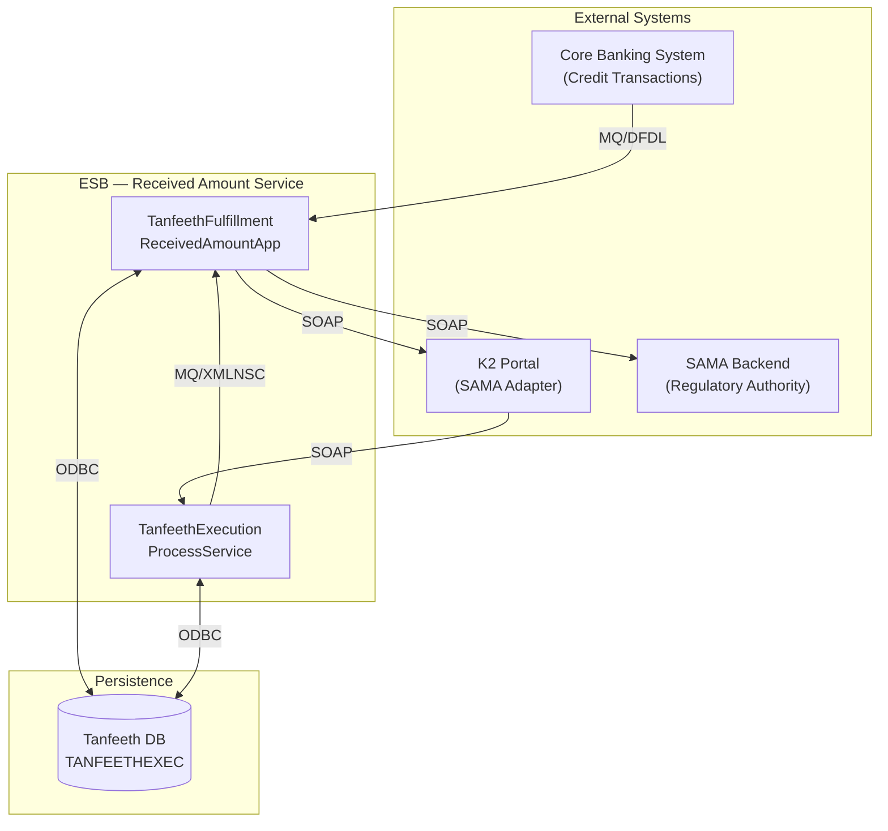
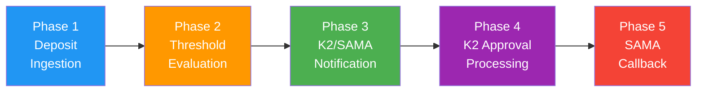
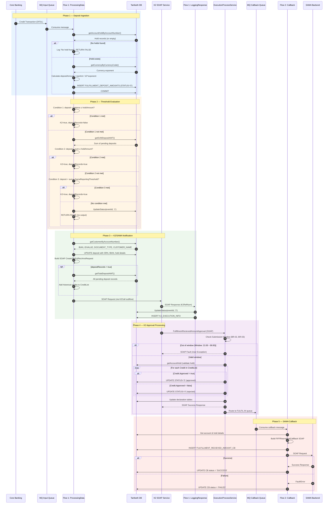
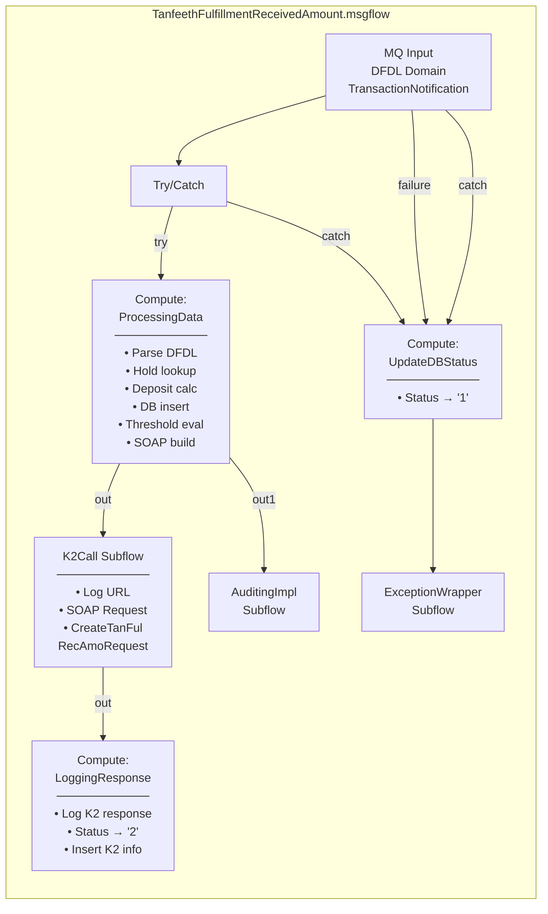
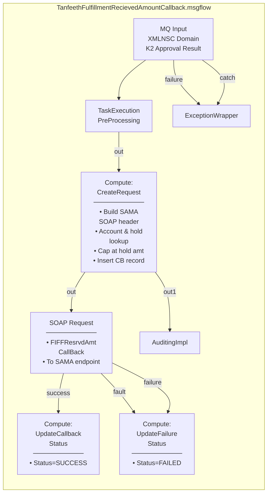
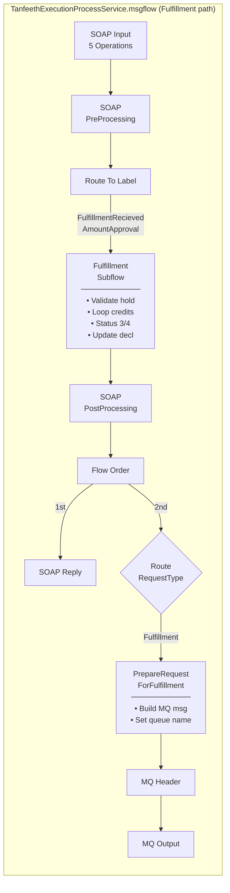
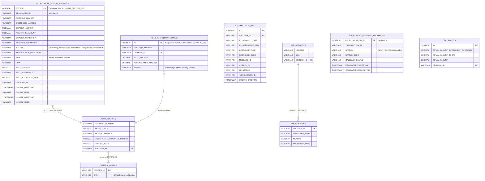
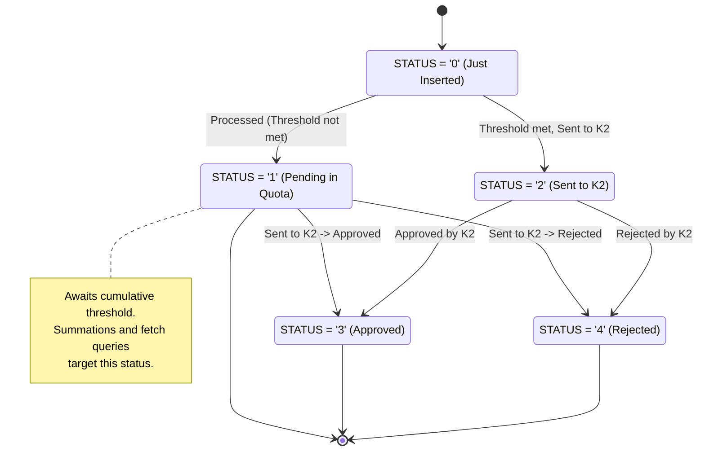
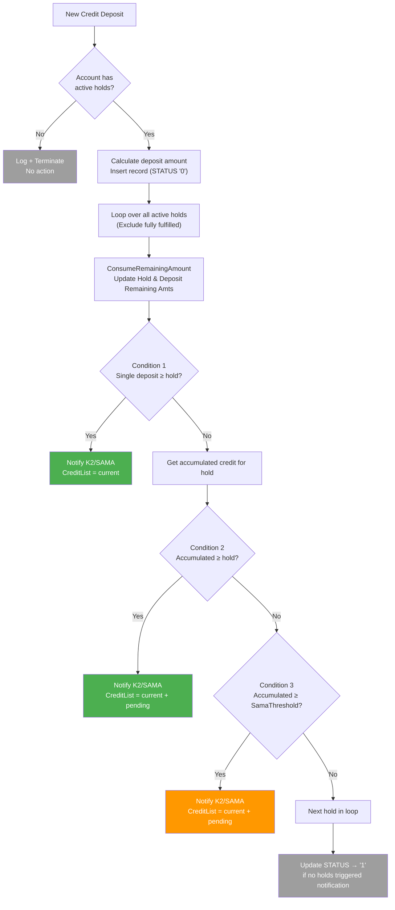
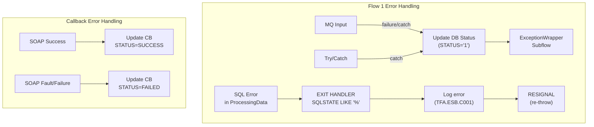

# Tanfeeth Fulfillment — Received Amount Service

## High-Level Design (HLD)

**Version:** 1.0  
**Date:** 2026-03-30  
**Status:** Extracted from production IIB codebase  
**System:** ESB Integration Layer (IBM IIB)  
**Regulatory Body:** SAMA (Saudi Arabian Monetary Authority)jdbc

---

## 1. Service Overview

The **Received Amount Service** is a regulatory compliance integration that monitors credit transactions posted to customer accounts subject to SAMA-imposed Tanfeeth holds. When cumulative deposits meet defined thresholds, the system notifies SAMA and processes the resulting approval/rejection cycle.

### 1.1 Business Objective

```
When SAMA issues a Tanfeeth enforcement order:
  1. Bank places a HOLD on the customer's account
  2. Customer can still RECEIVE credits (salary, transfers, etc.)
  3. Bank must TRACK every credit to the held account
  4. Bank must NOTIFY SAMA when thresholds are met
  5. K2 portal REVIEWS and approves/rejects each credit
  6. Bank REPORTS final approved amounts back to SAMA
```

### 1.2 Service Boundaries



---

## 2. System Context

### 2.1 Actors & Interfaces

| Actor | Interface | Protocol | Direction | Purpose |
|-------|-----------|----------|-----------|---------|
| **Core Banking System** | MQ Queue `MIKE.IIB.TanfeethFulfillRecievedAmount` | MQ → DFDL | Inbound | Credit transaction notifications |
| **K2 / SAMA Adapter** | `K2IntService.svc` | SOAP/HTTP | Outbound | Send received amount notification |
| **K2 / SAMA Adapter** | `TanfeethExecutionProcessService` | SOAP/HTTP | Inbound | Receive approval/rejection |
| **SAMA Backend** | `FIFFResrvdAmtCallBack` | SOAP/HTTP | Outbound | Report final approved amounts |
| **Tanfeeth Database** | `SAIBAPP` ODBC | SQL/ODBC | Bidirectional | Persistence & lookups |

### 2.2 Application Components

| Component | IIB Type | Description |
|-----------|----------|-------------|
| `TanfeethFulfillmentReceivedAmountApp` | Application | Main app container — 2 message flows |
| `TanfeethFulfillmentReceivedAmountLib` | Shared Library | DFDL model (`TransactionNotification`) |
| `TanfeethExecutionProcessService` | Service | SOAP service — 5 operations (shared with other Tanfeeth flows) |
| `TanfeethExecutionProcessLib` | Shared Library | WSDL/XSD for the execution process service |
| `TanfeethFulfillmentRecievedAmountCallbackLib` | Shared Library | WSDL/XSD for SAMA callback |
| `TanfeethICSLib` | Shared Library | ICS copybooks, XSD models, currency data |

---

## 3. End-to-End Flow Architecture

### 3.1 Phase Diagram



### 3.2 Complete Sequence



---

## 4. Component Architecture

### 4.1 Flow 1 — Received Amount Processing



**Key Design Decisions:**

- DFDL parsing for ICS mainframe-format messages
- Explicit `COMMIT` after deposit insert (before threshold evaluation)
- Three-condition threshold evaluation in priority order
- K2Call as a reusable subflow with configurable endpoint URL (UDP)

### 4.2 Flow 2 — SAMA Callback



### 4.3 ExecutionProcessService — Fulfillment Operation



---

## 5. Data Architecture

### 5.1 Database Tables



### 5.2 Deposit Status Lifecycle



### 5.3 Key Database Queries

| Query | Purpose | Called By |
|-------|---------|----------|
| `getAccountHoldByAccountNumber` | Get active holds for an account (joined with CRITERIA_DETAILS for SRN) | Flow 1: ProcessingData |
| `getCurrencyByCurrencyCode` | Get currency exponent for amount calculation | Flow 1: ProcessingData |
| `getSUMDepositAMT` | Sum pending deposits for cumulative threshold check | Flow 1: ProcessingData |
| `getTotalDepositAMT` | Get all pending deposit records for CreditList | Flow 1: ProcessingData |
| `getCustomerByAccountNumber` | Get customer IBAN, ID, name for SAMA notification | Flow 1: ProcessingData |
| `UpdateStatus` | Update deposit record status | Flow 1: ProcessingData, LoggingResponse |
| `getAccountHoldByAccountNumberCriteriaID` | Validate hold for specific criteria | ExecSvc: Fulfillment, Callback |
| `SelectDecleration` / `SelectDeclerationDetails` | Get existing declaration for update | ExecSvc: Fulfillment |

---

## 6. Integration Contracts

### 6.1 Inbound — Credit Transaction (MQ/DFDL)

| Property | Value |
|----------|-------|
| **Queue** | `MIKE.IIB.TanfeethFulfillRecievedAmount` |
| **Domain** | DFDL |
| **Message Type** | `TransactionNotification` |
| **Model** | `TanfeethFulfillmentReceivedAmountLib` |

**Key Fields:**

| Field | Description |
|-------|-------------|
| `MsgReqDat.CusAcc` | Customer account number |
| `MsgReqDat.CusNum` | Customer CIF number |
| `MsgReqDat.CusAccCcy` | Account currency (ISO 4217) |
| `MsgReqDat.TrxAmt` | Raw transaction amount (needs exponent conversion) |
| `MsgReqDat.Trxdir` | Transaction direction ("C" for credit) |

### 6.2 Outbound to K2 — Received Amount Notification (SOAP)

| Property | Value |
|----------|-------|
| **Operation** | `CreateTanFulRecAmoRequest` |
| **WSDL** | `K2IntService.wsdl` |
| **Namespace** | `http://tempuri.org/` |
| **Endpoint** | Configurable via UDP `endPointURL` |

```xml
<soapenv:Envelope>
  <soapenv:Body>
    <tem:CreateTanFulRecAmoRequest>
      <tem:Request>
        <saib:AccountCurrency/>
        <saib:AccountNumber/>
        <saib:CreditList>
          <ns:Credit>                       <!-- Current + historical -->
            <ns:AmountInAccountCurrency/>
            <ns:DepositeCurrency/>
            <ns:EventId/>                   <!-- Only for historical -->
            <ns:ExchnageRate/>
            <ns:PostingDate/>
            <ns:SourceAmount/>
          </ns:Credit>
        </saib:CreditList>
        <saib:Currency/>
        <saib:CustomerID/>
        <saib:CustomerName/>
        <saib:ESBReferenceNumber/>          <!-- CRITERIA_ID -->
        <saib:ExchageRate/>
        <saib:HoldAmount/>
        <saib:HoldAmountCurrency/>
        <saib:IBAN/>
        <saib:IDType/>
        <saib:ReportingDateTime/>
        <saib:SamaRefNum/>                  <!-- SRN -->
      </tem:Request>
    </tem:CreateTanFulRecAmoRequest>
  </soapenv:Body>
</soapenv:Envelope>
```

### 6.3 Inbound from K2 — Approval Confirmation (SOAP)

| Property | Value |
|----------|-------|
| **Operation** | `FulfillmentRecievedAmountApproval` |
| **WSDL** | `TanfeethExecutionProcessService.wsdl` |
| **Namespace** | `http://www.saib.com.sa/integration/TanfeethExecutionProcess/1.0` |
| **URL** | `/integration/TanfeethExecutionProcess/1.0` |

```xml
<FulfillmentRecievedAmountApproval>
    <ESBReferanceNumber>CRIT-001</ESBReferanceNumber>
    <AccountNumber>0012345678</AccountNumber>
    <CreditList>
        <Credit>
            <AmountInAccountCurrency>5000.00</AmountInAccountCurrency>
            <DepositeCurrency>SAR</DepositeCurrency>
            <EventId>12345</EventId>
            <ExchnageRate>1.0</ExchnageRate>
            <SourceAmount>5000.00</SourceAmount>
            <Approved>true</Approved>           <!-- K2 decision -->
        </Credit>
    </CreditList>
</FulfillmentRecievedAmountApproval>
```

### 6.4 Outbound to SAMA — Reserved Amount Callback (SOAP)

| Property | Value |
|----------|-------|
| **Operation** | `FIFFResrvdAmtCallBack` |
| **WSDL** | `FIFFResrvdAmtCallBack.wsdl` |
| **Namespace** | `http://www.sama.bea.sa/execution/services/FIFFResrvdAmtCallBack` |
| **Endpoint** | Configurable via UDP `SAMAEndpoint` |

### 6.5 Internal — MQ Callback Queue

| Property | Value |
|----------|-------|
| **Queue** | `IIB.TNFTH.EXECUTION.K2.PRCS.FULFIL.IN` |
| **Domain** | XMLNSC |
| **Direction** | ExecSvc → ReceivedAmountApp Callback Flow |

---

## 7. Threshold Decision Logic

### 7.1 Decision Tree



### 7.2 CreditList Composition Rules

| Trigger | CreditList Contents | `depositRecords` Flag |
|---------|--------------------|-----------------------|
| Condition 1 (single deposit + balance ≥ hold) | Current deposit only | `false` |
| Condition 2 (cumulative ≥ hold) | Current deposit + all pending from DB | `true` |
| Condition 3 (cumulative ≥ SamaReportingThreshold UDP) | Current deposit + all pending from DB | `true` |

---

## 8. Configuration & Deployment

### 8.1 User-Defined Properties (UDPs)

| UDP | Default | Scope | Description |
|-----|---------|-------|-------------|
| `LoggerName` | `FulfillmentRecievedAmount` | Flow 1 | Log4j logger name |
| `SamaReportingThreshold` | `5000.00` | Flow 1 | Dynamic threshold for sending deposit reports to SAMA |
| `endPointURL` | `Http://K2` | K2Call subflow | K2 SOAP endpoint URL |
| `SAMAEndpoint` | `http://samaendpoint` | Callback flow | SAMA SOAP endpoint URL |
| `ISCALLBACK_REQUIRED` | `('E1020024','E1020025')` | ExecSvc | SAMA status codes requiring callback |
| `SamaSubmissionStartTime`| `'21:00:00'` | ExecSvc | Start of SAMA allowed window (BR-02) |
| `SamaSubmissionEndTime` | `'06:00:00'` | ExecSvc | End of SAMA allowed window (BR-02) |

### 8.2 Data Sources

| Name | Used By | Purpose |
|------|---------|---------|
| `SAIBAPP` | All compute nodes | Main Tanfeeth database connection |
| `SOSDB` | Currency lookup | Currency list / exponent reference data |

### 8.3 Queue Configuration

| Queue Name | Direction | Domain | Consumer |
|-----------|-----------|--------|----------|
| `MIKE.IIB.TanfeethFulfillRecievedAmount` | Input | DFDL | Flow 1 |
| `IIB.TNFTH.EXECUTION.K2.PRCS.FULFIL.IN` | Internal | XMLNSC | Callback Flow |

### 8.4 Logging & Monitoring

| Category | Configuration |
|----------|---------------|
| **Framework** | Log4j v1 (DailyRollingFileAppender) |
| **Log File** | `/home/S803SOSA/soaApps/IIB/TanfeethFulfillmentRecievedAmountApp/logs/` |
| **Max Size** | 10 MB per file |
| **Max Backup** | 50 files |
| **BAM** | Business Activity Monitoring via AuditingImpl subflow |
| **Correlation** | MQ CorrelId + MsgId (hex-decoded) |

---

## 9. Error Handling Strategy

### 9.1 Error Flow



### 9.2 Error Codes

| Code | Scope | Description |
|------|-------|-------------|
| `TFA.ESB.C001` | All DB operations | Generic database error (INSERT, UPDATE, SELECT failures) |
| `BIP 2951` | User exception | Custom IIB exception with error message |

---

## 10. Security Considerations

| Aspect | Current State | Recommendation |
|--------|--------------|----------------|
| **Transport** | HTTP (no TLS enforcement) | Enforce HTTPS for all SOAP endpoints |
| **PII in Logs** | Full request body logged at INFO | Mask account numbers, customer names, IBANs |
| **Authentication** | None visible in code | Add WS-Security or mutual TLS |
| **Data at Rest** | Standard DB storage | Encrypt PII columns in TANFEETHEXEC schema |

---

## 11. Non-Functional Characteristics

| Attribute | Target | Notes |
|-----------|--------|-------|
| **Throughput** | Process each message within 2 seconds | Under normal DB load |
| **DB Query Latency** | Each query < 500ms | Hold lookup, sum, customer info |
| **Availability** | Follow IIB broker HA configuration | No custom HA in flow |
| **Idempotency** | Not implemented | Risk of duplicate deposit records on retry |
| **Audit Trail** | Every deposit tracked in DB | `FULFILLMENT_DEPOSIT_AMOUNTS` with timestamps |
| **Transaction Integrity** | Manual COMMIT in code | Risk of partial commits |

---

## 12. Phase 4: K2 Confirmation Processing

This process activates when the K2 portal returns approval payloads back through `TanfeethExecutionProcessService`.

### 12.1 Execution Routing
1. The K2 portal invokes the `FulfillmentRecievedAmountApproval` process via ESB.
2. The core router maps the incoming approval to the `IIB.TNFTH.EXECUTION.K2.PRCS.FULFIL.IN` internal queue.
3. The original declaration and deposit lists are re-queried, updating execution logic.
4. Database updates trigger status shifts to `STATUS = '3'` (Approved) or `STATUS = '4'` (Rejected).

---

## 13. Phase 5: SAMA Callback Integration

This phase manages the outbound notification to the SAMA endpoint confirming that the held funds have successfully been reserved for fulfillment.

### 13.1 Callback Logic
1. Messages land on `IIB.TNFTH.EXECUTION.K2.PRCS.FULFIL.IN`.
2. The Integration App formats the payload via DFDL/XML schema parameters towards `FIFFResrvdAmtCallBack`.
3. If an HTTP connection issue or 500 error takes place with SAMA, the system logs the fault and transitions into the Fallback sequence.
4. The response status is logged comprehensively into `TANFEETHEXEC.K2_EXECUTION_INFO` to leave a robust audit trail.

---

## 14. Known Limitations & Future Improvements

| # | Limitation | Impact | Priority |
|---|------------|--------|----------|
| 1 | Only first hold record processed per account | Multiple holds ignored | [RESOLVED] Fixed in Refactored.esql via multi-hold loop / progressive consumption |
| 4 | No idempotency / deduplication | Duplicate deposits on MQ retry | High |
| 6 | PII logged in full | SAMA data protection non-compliance | Medium |
| 7 | Single error code for all DB failures | Hard to diagnose in production | Low |
| 8 | SOAP field typos (`DepositeCurrency`, `ExchnageRate`) | Can't fix without SAMA schema change | Low |
| 9 | ~~Phases 4-5 not documented in spec~~ | [RESOLVED] Phase 4-5 documented in Sections 12-13 | N/A |
| 10 | No monitoring metrics | Limited operational visibility | Medium |

---

## 15. SAMA Submission Gatekeeper (Time/Calendar Validation)

This logic enforces SAMA regulatory windows for manual approvals received from the K2 portal.

### 15.1 Business Rules
*   **BR-02 (Time Window)**: Manual approvals from K2 are only permitted when `CURRENT_TIME` is between `SamaSubmissionStartTime` and `SamaSubmissionEndTime` (default 21:00 to 06:00).
*   **BR-03 (Calendar Restriction)**: Manual approvals are blocked on:
    *   **Fridays** (IIB `DAYOFWEEK` = 6)
    *   **Saturdays** (IIB `DAYOFWEEK` = 7)
    *   **Official Holidays** (Determined via `checkIsHoliday` procedure in `Utils.esql`)

### 15.2 Implementation
*   **Entry Point**: `FulfillmentRecievedAmount_processRequest.esql :: Main()`
*   **Error Handling**: If a check fails, a `USER EXCEPTION` is thrown with a descriptive message, which triggers a SOAP Fault back to the K2 user.
*   **Configurability**: The window start and end times are configurable via **User-Defined Properties (UDPs)** without needing a code redeploy.

