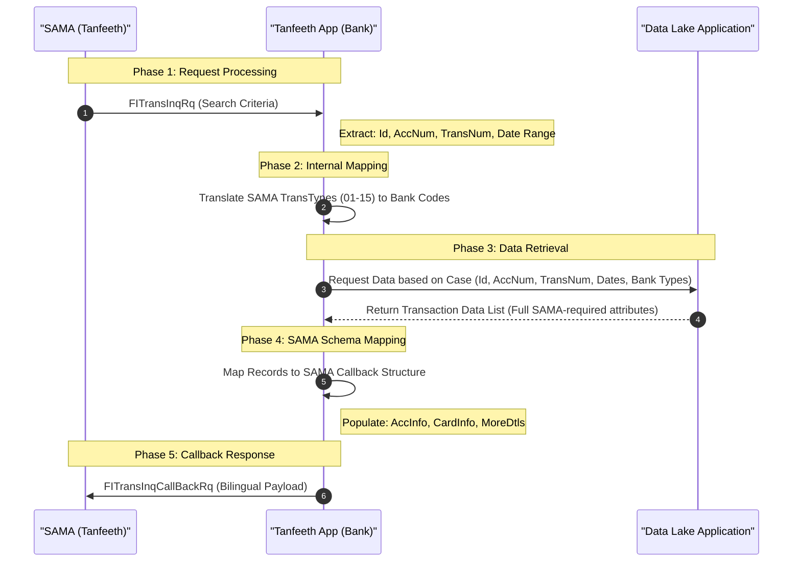

# Transaction Inquiry: Data Flow Architecture

This diagram illustrates the high-level integration between SAMA, the Bank Application, and the Data Lake for processing transaction inquiries.

---

## 1. End-to-End Data Flow (Sequence Diagram)

---

## 2. Component Responsibilities

| Component | Responsibility |
| :--- | :--- |
| **SAMA (Tanfeeth)** | Initiates inquiry via SOAP Request; Receives final Callback Response. |
| **Tanfeeth App** | Manages security, business logic, type mapping (SAMA ↔ Bank), and XML transformation. |
| **Data Lake** | Serves as the golden source for historical and current transaction records across all products. |

---

## 3. Data Point Mapping Summary

| Inquiry Parameter | App Processing Logic |
| :--- | :--- |
| **Id** | Used to filter records belonging to a specific National ID/Iqama. |
| **Account Number** | Direct filter on `AccInfo` records within the Data Lake. |
| **Transaction Number** | Used for Scenario A (Unique record retrieval). |
| **Date Range** | Applied to `TransDate` for duration-based searches (Scenario B). |
| **Transaction Types** | **Critical Steps**: Convert SAMA Codes (e.g., 03) to internal Bank Transaction Codes before querying. |
