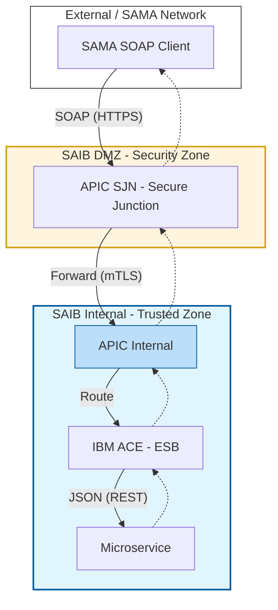
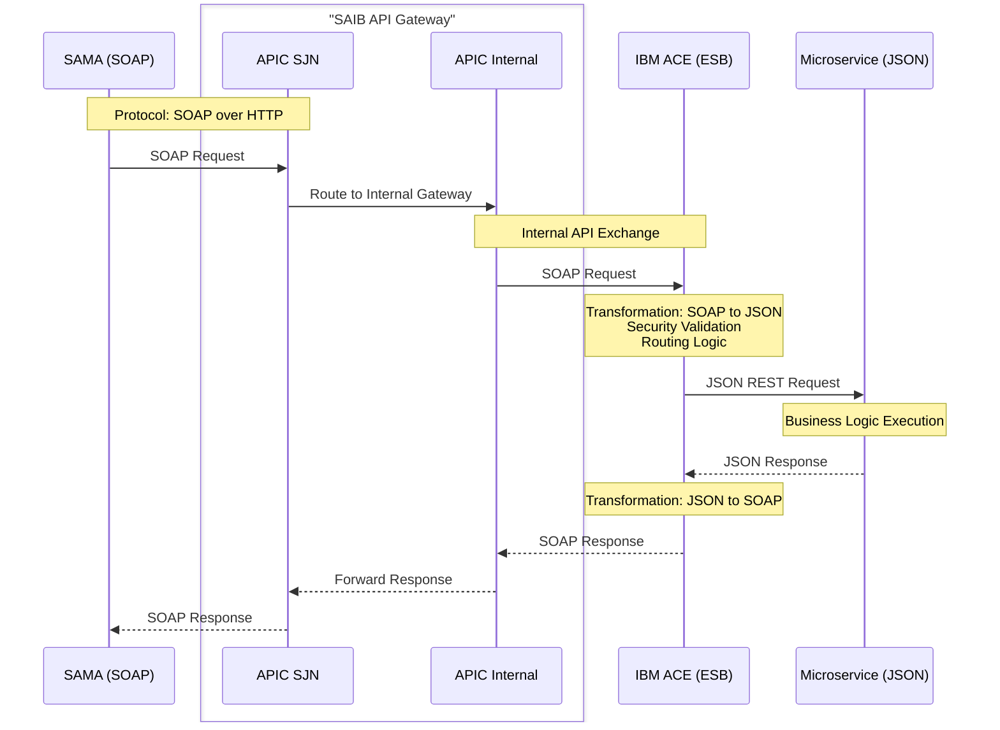
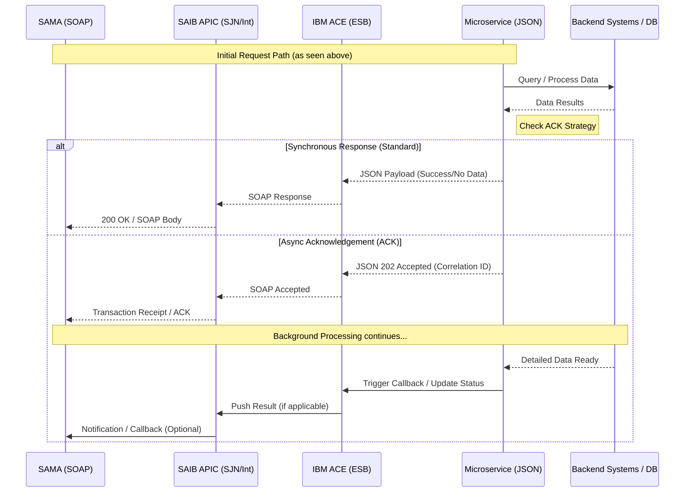

# SAMA-SAIB Integration Flow Design

This document details the request and acknowledgment (ACK) flows for the integration between SAMA and SAIB.

## 1. Network & Architecture Flow

This diagram illustrates where each component resides within the SAIB network infrastructure, specifically highlighting the position of **APIC Internal** in the Trusted Zone.

## 2. Sequence Diagram (Request Flow)

## 3. Acknowledgment (ACK) Flow: Transaction / Doc Inquiry

The ACK flow specifically handles the asynchronous or synchronous acknowledgment requirements for services like Transaction Search and Document Inquiry.

## 4. Component Responsibilities & Locations

| Component | Location | Responsibility |
| :--- | :--- | :--- |
| **SAMA** | External | Initiates SOAP requests. |
| **APIC SJN** | **DMZ** | Secure Junction; handles perimeter security and authentication. |
| **APIC Internal** | **Internal Zone** | Central traffic management and routing within the trusted network. |
| **IBM ACE (ESB)** | **Internal Zone** | Protocol conversion (SOAP ↔ JSON) and specialized routing. |
| **Microservice** | **Internal Zone** | Core business logic and data processing. |
